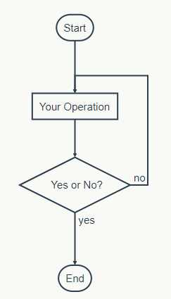
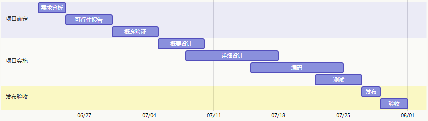

# MarkDown 公开课

## 课程说明
Markdown是一种可以使用普通文本编辑器编写的标记语言，通过简单的标记语法，它可以使普通文本内容具有一定的格式。

Markdown 的目标是实现「易读易写」。

可读性，无论如何，都是最重要的。一份使用 Markdown 格式撰写的文件应该可以直接以纯文本发布，并且看起来不会像是由许多标签或是格式指令所构成。Markdown 语法受到一些既有 text-to-HTML 格式的影响。

Markdown 是一种方便记忆、书写的纯文本标记语言，用户可以使用这些标记符号以最小的输入代价生成极富表现力的文档：譬如您正在阅读的这份文档。它使用简单的符号标记不同的标题，分割不同的段落，**粗体** 或者 *斜体* 某些文字

> * 整理知识，学习笔记
> * 发布日记，杂文，所见所想
> * 撰写发布技术文稿（代码支持）
> * 撰写发布学术论文（LaTeX 公式支持）

 [本课程的大纲](http://naotu.baidu.com/file/ad4cce151783a3214308a38773ec1456)

## 常用工具

### 在线工具
- [github](https://github.com) 
- [简书](https://www.jianshu.com)
- http://mahua.jser.me/
- https://www.zybuluo.com/mdeditor
- https://www.mdeditor.com/

### 本地工具
- Typora 下载地址： https://www.typora.io/
- vscode 下载地址：https://code.visualstudio.com/

## 基础语法
### 标题
Markdown支持6种级别的标题，对应html标签 h1 ~ h6

```markdown
# h1
## h2
### h3
#### h4
##### h5
###### h6
```
以上标记效果如下：
># h1
>## h2
>### h3
>#### h4
>##### h5
>###### h6

除此之外，Markdown还支持另外一种形式的标题展示形式，其类似于 Setext 标记语言的表现形式，使用下划线进行文本大小的控制
```markdown
这是一级标题
===
这是二级标题
---
```
对应
> 这是一级标题
>===
>这是二级标题
>---

### 段落及区块引用

需要记住的是，Markdown其实就是一种易于编写的普通文本，只不过加入了部分渲染文本的标签而已。其最终依然会转换为html标签，因此使用Markdown分段非常简单，前后至少保留一个空行即可。
而另外一个比较常见的需求就是，我们可能希望对某段文字进行强调处理。Markdown提供了一个特殊符号>用于段首进行强调，被强调的文字部分将会高亮显示


```markdown
> 这段文字将被高亮显示...
```

> 这段文字将被高亮显示...

### 图片


### 链接

[点击跳转至百度](http://www.baidu.com)

[宁波信息学学习平台](http://oj.nbdp.net)

注： 引用图片和链接的唯一区别就是在最前方添加一个感叹号。

### 分隔线

你可以在一行中用三个以上的星号、减号、底线来建立一个分隔线，行内不能有其他东西。你也可以在星号或是减号中间插入空格。下面每种写法都可以建立分隔线：

内容
* * *
内容1
***
内容2
*****
内容3
- - -
内容4
-----------


### 列表
Markdown 支持有序列表和无序列表。

无序列表使用星号、加号或是减号作为列表标记：

*   Red
*   Green
*   Blue
等同于：

+   Red
+   Green
+   Blue
也等同于：

-   Red
-   Green
-   Blue
有序列表则使用数字接着一个英文句点：
1.  Bird
2.  McHale
3.  Parish

### 列表特殊用法

- [ ] 支持以 PDF 格式导出文稿
- [ ] 改进 Cmd 渲染算法，使用局部渲染技术提高渲染效率
- [x] 新增 Todo 列表功能
- [x] 修复 LaTex 公式渲染问题
- [x] 新增 LaTex 公式编号功能

### 强调

使用星号（*）和底线（_）作为标记强调字词的符号，被 * 或 _ 包围的字词会被转成用 `<em>` 标签包围，用两个 * 或 _ 包起来的话，则会被转成 `<strong>`，例如：

*初赛题库是一个很棒的网站*

_学信息学的孩子都是聪明的孩子_

**学习信息学必须经常要刷题**

__IOer会问你今天`AC`了吗__

## 高级用法

### 代码
在IT圈子里面比较流行的一个重要原因是，它能够轻松漂亮地插入代码。

方法是，使用反引号\`进行包裹即可。如果是行内代码引用，使用单个反引号进行包裹

```C++
#include <iostream>
using namespace std;
int main(){
    int a,b;
    while(cin >> a >> b)
        cout << a+b << endl;
	return 0;
}
```

```C
#include <stdio.h>
int main(){
    int a,b;
    while(scanf("%d %d",&a, &b) != EOF)
        printf("%d\n",a+b);
	return 0;
}
```


```pascal
program p1001(Input,Output); 
var 
  a,b:Integer; 
begin 
   while not eof(Input) do 
     begin 
       Readln(a,b); 
       Writeln(a+b); 
     end; 
end.
```

### 流程图 
> 不一定支持

```flow
st=>start: Start
op=>operation: Your Operation
cond=>condition: Yes or No?
e=>end

st->op->cond
cond(yes)->e
cond(no)->op
```


### 甘特图
```gantt
    title 项目开发流程
    section 项目确定
        需求分析       :a1, 2016-06-22, 3d
        可行性报告     :after a1, 5d
        概念验证       : 5d
    section 项目实施
        概要设计      :2016-07-05  , 5d
        详细设计      :2016-07-08, 10d
        编码          :2016-07-15, 10d
        测试          :2016-07-22, 5d
    section 发布验收
        发布: 2d
        验收: 3d
```


### 插入表格
表格是Markdown语法中比较复杂的一个，其语法如下：

表头|条目一|条目二
:---:|:---:|:---:
项目|项目一|项目二

表2


 项目        | 价格   |  数量  |
 --------   | -----:  | :----:  |
 计算机     | $1600 |   5     |
 手机        |   $12   |   12   |
 管线        |    $1    |  234  |

注：三个短斜杠左右的冒号用于控制对齐方式，只放置左边冒号表示文字居左，只放置右边冒号表示文字居右，如果两边都放置冒号表示文字居中。


### 其他
#### 反斜杠

利用反斜杠来插入一些在语法中有其它意义的符号，例如：如果你想要用星号加在文字旁边的方式来做出强调效果（但不用 `<em>` 标签），你可以在星号的前面加上反斜杠：

#### 自动链接
<http://example.com/>

#### 链接引用

我是来自来于[宁波信息学学习平台][1]的水滴老师,QQ号：435844911，请加入我们的群：中小学信息学及编程:`368112645`

#### LaTeX [^LaTeX]
`MathJax` 语法
$\sum_{i=1}^n a_i=0$


[^LaTeX]: 支持 **LaTeX** 编辑显示支持，例如：$\sum_{i=1}^n a_i=0$， 访问 [MathJax][2] 参考更多使用方法。


[1]: http://oj.nbdp.net/ "宁波信息学学习平台"
[2]: http://meta.math.stackexchange.com/questions/5020/mathjax-basic-tutorial-and-quick-reference